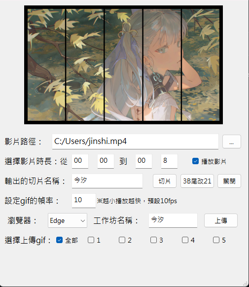
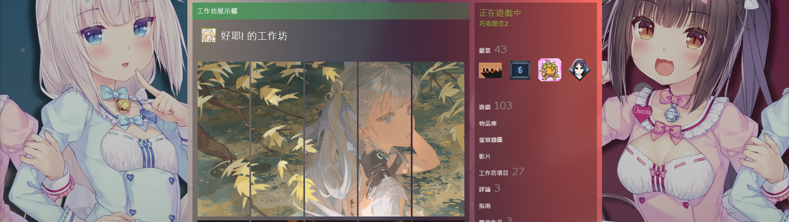

# Steam-Workshop-GIF-Converter

🇨🇳 中文版 | [🇺🇸 English](README_EN.md)

一個專為 Steam Workshop 設計的影片處理工具，可將影片自動切割成 5 個 GIF 片段並直接上傳到 Steam Workshop。



### 🎮 Steam Workshop 實際效果


## ✨ 主要功能

- 🎬 **智慧影片切割**：自動將影片分割為 5 個等寬 GIF 片段
- ⚙️ **自訂 FPS 設定**：可調整 GIF 播放速度（1-60 FPS，預設 10 FPS）
- 📤 **選擇性上傳**：支援選擇特定片段上傳到 Steam Workshop
- 🔧 **GIF 修復功能**：自動修正 GIF 檔案結尾標記（3B改21）
- 📊 **即時進度顯示**：完整的處理進度追蹤與狀態提示
- 🎯 **輸入驗證**：智慧型錯誤檢查與提示系統
- 🌐 **多瀏覽器支援**：支援 Chrome 和 Edge 自動化上傳
- 🎥 **即時預覽**：支援影片播放預覽功能

## 📋 系統需求

### 軟體需求
- Windows 10/11
- Python 3.7+
- 支援的瀏覽器：Chrome 或 Edge（需安裝對應 WebDriver）

### 硬體建議
- RAM：8GB 以上（處理大型影片檔案）
- 硬碟空間：至少 1GB 可用空間
- 處理器：建議 Intel i5 或 AMD Ryzen 5 以上

## 🔧 安裝說明

### 1. 下載專案
```bash
git clone https://github.com/[你的用戶名]/Steam-Workshop-GIF-Converter.git
cd Steam-Workshop-GIF-Converter
```

### 2. 安裝依賴套件
```bash
pip install -r requirements.txt
```

**requirements.txt 內容：**
```
PyQt5>=5.15.0
moviepy>=1.0.3
selenium>=4.0.0
opencv-python>=4.5.0
Pillow>=8.0.0
```

### 3. 下載 WebDriver
- **Chrome**：下載 [ChromeDriver](https://chromedriver.chromium.org/)
- **Edge**：下載 [EdgeDriver](https://developer.microsoft.com/en-us/microsoft-edge/tools/webdriver/)

將 WebDriver 執行檔放入系統 PATH 或程式目錄

### 4. 執行程式
```bash
python SteamVideoClip.py
```

## 📖 使用說明

### 基本操作流程

1. **選擇影片檔案**
   - 點擊「...」按鈕選擇影片
   - 支援格式：MP4, MKV, MOV, AVI, M4V
   - 檔案大小建議不超過 200MB

2. **設定時間區間**
   - 開始時間：分鐘:秒數（例如：00:05）
   - 結束時間：分鐘:秒數（例如：00:15）
   - 建議處理時間不超過 20 秒

3. **調整參數**
   - 輸出檔案名稱：自訂 GIF 檔案前綴
   - GIF 幀率設定：1-60 FPS（預設 10 FPS）
   - ⚠️ **注意**：數值越小播放越快

4. **處理影片**
   - 點擊「切片」開始處理
   - 程式會自動分割為 5 個 GIF 檔案（part1-part5）
   - 自動調整過大檔案至 5MB 以下
   - 備註：如果要取得更好的效果可以使用[Waifu2x](https://github.com/AaronFeng753/Waifu2x-Extension-GUI/)優化GIF效果 並使用[ezgif](https://ezgif.com/optimize?err=expired)優化GIF檔案大小

5. **上傳到 Steam Workshop**
   - 選擇瀏覽器（Chrome 或 Edge）
   - 設定工作坊名稱
   - 選擇要上傳的片段：
     - ☑️ **全部**：上傳所有 5 個片段
     - ☑️ **1-5**：選擇特定片段上傳
   - 點擊「上傳」自動批次上傳

### 進階功能

#### 🔐 自動登入設定
建立 `user.txt` 檔案（與程式同目錄）：
```
你的Steam帳號
你的Steam密碼
```

#### 🔧 GIF 修復功能
- 自動修正 GIF 檔案結尾標記（將 3B 改為 21）
- 點擊「3B尾改21」手動執行修復
- 解決某些平台的 GIF 相容性問題

#### 📊 進度監控
- 即時顯示處理進度（0-100%）
- 詳細狀態提示：載入、裁剪、生成、修復
- 大檔案處理時間預估

## 📷 使用範例

### 處理流程示意圖
```
原始影片 (1920x1080)
    ↓ 時間裁剪 (0:05-0:15)
    ↓ 尺寸調整 (770x449)
    ↓ 水平分割
┌─────┬─────┬─────┬─────┬─────┐
│Part1│Part2│Part3│Part4│Part5│
└─────┴─────┴─────┴─────┴─────┘
    ↓ 輸出為 GIF
output_gif_part1.gif ~ output_gif_part5.gif
```

### 輸出檔案命名規則
```
{輸出名稱}_part{編號}.gif
範例：
- output_gif_part1.gif
- output_gif_part2.gif
- output_gif_part3.gif
- output_gif_part4.gif
- output_gif_part5.gif
```

## ❓ 常見問題

### Q: 程式無法啟動瀏覽器？
**A:** 請確認已正確安裝對應的 WebDriver：
- 檢查 ChromeDriver/EdgeDriver 版本是否與瀏覽器版本匹配
- 確認 WebDriver 已加入系統 PATH
- 嘗試手動執行 WebDriver 測試連線

### Q: 影片處理失敗？
**A:** 檢查以下項目：
- 影片格式是否支援（建議使用 MP4）
- 檔案是否損壞（嘗試用其他播放器開啟）
- 硬碟空間是否充足
- 對於大型檔案，建議縮短處理時間

### Q: 上傳到 Steam 失敗？
**A:** 常見解決方案：
- 確認網路連線穩定
- 檢查 Steam 帳號是否正常登入
- 確認 GIF 檔案大小不超過 5MB
- 檢查工作坊名稱是否包含特殊字符

### Q: GIF 檔案過大？
**A:** 優化建議：
- 降低 FPS 設定（如改為 8 或 6）
- 縮短處理時間（如改為 5-8 秒）
- 程式會自動壓縮超過 5MB 的檔案

### Q: 處理速度太慢？
**A:** 效能優化：
- 使用 SSD 硬碟
- 增加系統記憶體
- 選擇較短的影片片段
- 關閉其他佔用記憶體的程式

## 🔧 技術規格

### 主要依賴套件
- **PyQt5**：GUI 介面框架與視覺元件
- **MoviePy**：影片處理引擎與 GIF 生成
- **Selenium**：瀏覽器自動化與 Steam 上傳
- **OpenCV**：影片讀取與幀率檢測
- **PIL (Pillow)**：圖像處理與壓縮

### 程式架構
```
SteamVideoClip.py
├── UI層 (PyQt5)
│   ├── 主視窗介面
│   ├── 進度條顯示
│   └── 錯誤處理對話框
├── 處理層 (MoviePy + OpenCV)
│   ├── 影片載入與驗證
│   ├── 時間裁剪與尺寸調整
│   ├── 水平分割算法
│   └── GIF 生成與壓縮
├── 上傳層 (Selenium)
│   ├── 瀏覽器自動化
│   ├── Steam 登入處理
│   └── 批次檔案上傳
└── 工具層
    ├── 輸入驗證系統
    ├── GIF 修復功能
    └── 檔案管理操作
```

### 效能特性
- **記憶體優化**：分段處理大型影片
- **錯誤恢復**：完整的異常處理機制
- **進度追蹤**：即時狀態回饋
- **資源管理**：自動釋放影片與瀏覽器資源

## 🤝 開發說明

### 開發環境設定
```bash
# 克隆專案
git clone https://github.com/howard1688/Steam-Workshop-GIF-Converter.git
cd Steam-Workshop-GIF-Converter

# 安裝開發依賴
pip install -r requirements-dev.txt

# 執行程式
python SteamVideoClip.py
```

### 程式結構說明
- `Ui_MainWindow`：主要 GUI 類別
- `split_video_to_gifs()`：影片處理核心函數
- `upload_gif()`：Steam 上傳功能
- `fix_gif_trailer()`：GIF 修復工具

### 貢獻指南
1. Fork 此專案
2. 建立功能分支 (`git checkout -b feature/新功能`)
3. 提交變更 (`git commit -am '新增功能: 詳細描述'`)
4. 推送到分支 (`git push origin feature/新功能`)
5. 建立 Pull Request

### 已知問題與改善計畫
- [ ] 支援更多影片格式（WEBM、FLV）
- [ ] 新增批次處理多個影片
- [ ] 支援自訂分割數量（不限於 5 個）
- [ ] 新增影片品質預設檔
- [ ] Steam 登入 2FA 雙重驗證支援

## 📄 授權資訊

此專案採用 MIT 授權條款 - 詳見 [LICENSE](LICENSE) 檔案

### 第三方套件授權
- PyQt5: GPL v3 License
- MoviePy: MIT License  
- Selenium: Apache 2.0 License
- OpenCV: Apache 2.0 License
- Pillow: PIL Software License

## 🙏 致謝

- **MoviePy 團隊**：提供優秀的影片處理套件
- **PyQt5 開發團隊**：提供強大的 GUI 框架
- **Selenium 專案**：實現瀏覽器自動化功能
- **Steam Workshop API**：支援內容上傳功能

---

## 🚀 快速開始

1. **下載並安裝 Python 3.7+**
2. **安裝依賴套件**：`pip install PyQt5 moviepy selenium opencv-python Pillow`
3. **下載對應的 WebDriver**
4. **執行程式**：`python SteamVideoClip.py`
5. **選擇影片 → 設定參數 → 切片 → 上傳**

⭐ **如果這個專案對您有幫助，請給個 Star！**

---

### 🔖 版本資訊
- **目前版本**：v1.0.0
- **最後更新**：2025-07-15
- **相容性**：Windows 10/11, Python 3.7+
