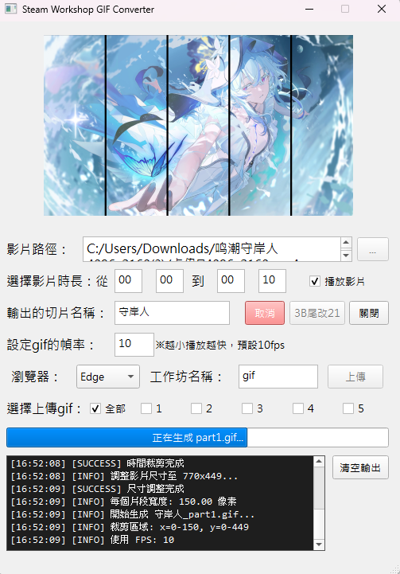
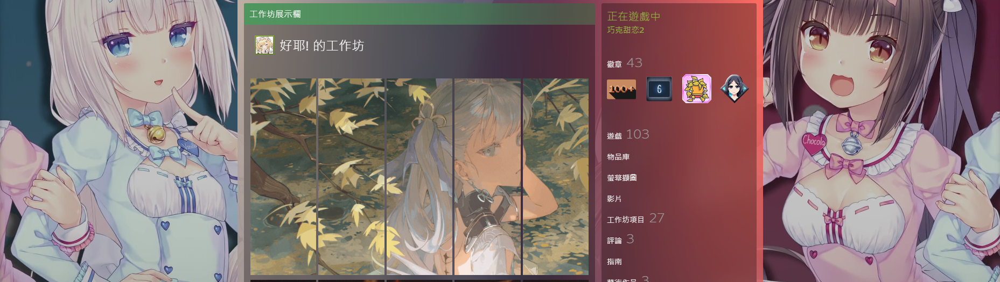

# Steam profile Customize tool

[🇨🇳 中文版](README.md) | 🇺🇸 English

A specialized video processing tool designed for Steam profile Workshop that automatically splits videos into 5 GIF segments and uploads them directly to Steam Workshop.



### 🎮 Steam Workshop Result


## ✨ Key Features

- 🎬 **Smart Video Splitting**: Automatically divides videos into 5 equal-width GIF segments
- ⚙️ **Custom FPS Settings**: Adjustable GIF playback speed (1-60 FPS, default 10 FPS)
- 📤 **Selective Upload**: Support for uploading specific segments to Steam Workshop
- 🔧 **GIF Repair Function**: Automatically fixes GIF file trailer markers (3B to 21)
- 📊 **Real-time Progress Display**: Complete processing progress tracking and status notifications
- 🎯 **Input Validation**: Intelligent error checking and notification system
- 🌐 **Multi-browser Support**: Supports Chrome and Edge automated uploads
- 🎥 **Live Preview**: Video playback preview functionality

## 📋 System Requirements

### Software Requirements
- Windows 10/11
- Python 3.7+
- Supported Browsers: Chrome or Edge (requires corresponding WebDriver)

### Hardware Recommendations
- RAM: 8GB or more (for processing large video files)
- Storage: At least 1GB available space
- Processor: Recommended Intel i5 or AMD Ryzen 5 or higher

## 🔧 Installation Guide

### 1. Download Project
```bash
git clone https://github.com/[your-username]/Steam-Workshop-GIF-Converter.git
cd Steam-Workshop-GIF-Converter
```

### 2. Install Dependencies
```bash
pip install -r requirements.txt
```

**requirements.txt contents:**
```
PyQt5>=5.15.0
moviepy>=1.0.3
selenium>=4.0.0
opencv-python>=4.5.0
Pillow>=8.0.0
```

### 3. Download WebDriver
- **Chrome**: Download [ChromeDriver](https://chromedriver.chromium.org/)
- **Edge**: Download [EdgeDriver](https://developer.microsoft.com/en-us/microsoft-edge/tools/webdriver/)

Place the WebDriver executable in your system PATH or program directory

### 4. Run Program
```bash
python SteamVideoClip.py
```

## 📖 User Guide

### Basic Operation Workflow

1. **Select Video File**
   - Click the "..." button to select a video
   - Supported formats: MP4, MKV, MOV, AVI, M4V
   - Recommended file size under 200MB

2. **Set Time Range**
   - Start time: minutes:seconds (e.g., 00:05)
   - End time: minutes:seconds (e.g., 00:15)
   - Recommended processing time under 20 seconds

3. **Adjust Parameters**
   - Output file name: Custom GIF file prefix
   - GIF frame rate setting: 1-60 FPS (default 10 FPS)
   - ⚠️ **Note**: Lower values = faster playback

4. **Process Video**
   - Click "Split" to start processing
   - Program automatically splits into 5 GIF files (part1-part5)
   - Automatically resizes large files to under 5MB

5. **Upload to Steam Workshop**
   - Select browser (Chrome or Edge)
   - Set workshop name
   - Choose segments to upload:
     - ☑️ **All**: Upload all 5 segments
     - ☑️ **1-5**: Select specific segments to upload
   - Click "Upload" for automatic batch upload

### Advanced Features

#### 🔐 Auto-login Setup
Create a `user.txt` file (in the same directory as the program):
```
YourSteamUsername
YourSteamPassword
```

#### 🔧 GIF Repair Function
- Automatically fixes GIF file trailer markers (changes 3B to 21)
- Click "3B to 21" to manually execute repair
- Solves GIF compatibility issues on certain platforms

#### 📊 Progress Monitoring
- Real-time progress display (0-100%)
- Detailed status notifications: loading, cropping, generating, repairing
- Processing time estimation for large files

## 📷 Usage Examples

### Processing Workflow Diagram
```
Original Video (1920x1080)
    ↓ Time Cropping (0:05-0:15)
    ↓ Size Adjustment (770x449)
    ↓ Horizontal Split
┌─────┬─────┬─────┬─────┬─────┐
│Part1│Part2│Part3│Part4│Part5│
└─────┴─────┴─────┴─────┴─────┘
    ↓ Output as GIF
output_gif_part1.gif ~ output_gif_part5.gif
```

### Output File Naming Convention
```
{output_name}_part{number}.gif
Examples:
- output_gif_part1.gif
- output_gif_part2.gif
- output_gif_part3.gif
- output_gif_part4.gif
- output_gif_part5.gif
```

## ❓ Frequently Asked Questions

### Q: Program cannot start browser?
**A:** Please confirm that the corresponding WebDriver is correctly installed:
- Check if ChromeDriver/EdgeDriver version matches browser version
- Ensure WebDriver is added to system PATH
- Try manually executing WebDriver to test connection

### Q: Video processing failed?
**A:** Check the following items:
- Is the video format supported (MP4 recommended)
- Is the file corrupted (try opening with other players)
- Is there sufficient disk space
- For large files, consider shortening processing time

### Q: Steam upload failed?
**A:** Common solutions:
- Ensure stable internet connection
- Check if Steam account is properly logged in
- Confirm GIF file size doesn't exceed 5MB
- Check if workshop name contains special characters

### Q: GIF file too large?
**A:** Optimization suggestions:
- Lower FPS settings (e.g., change to 8 or 6)
- Shorten processing time (e.g., change to 5-8 seconds)
- Program automatically compresses files over 5MB

### Q: Processing too slow?
**A:** Performance optimization:
- Use SSD drive
- Increase system memory
- Choose shorter video segments
- Close other memory-intensive programs

## 🔧 Technical Specifications

### Main Dependencies
- **PyQt5**: GUI framework and visual components
- **MoviePy**: Video processing engine and GIF generation
- **Selenium**: Browser automation and Steam upload
- **OpenCV**: Video reading and frame rate detection
- **PIL (Pillow)**: Image processing and compression

### Program Architecture
```
SteamVideoClip.py
├── UI Layer (PyQt5)
│   ├── Main window interface
│   ├── Progress bar display
│   └── Error handling dialogs
├── Processing Layer (MoviePy + OpenCV)
│   ├── Video loading and validation
│   ├── Time cropping and size adjustment
│   ├── Horizontal splitting algorithm
│   └── GIF generation and compression
├── Upload Layer (Selenium)
│   ├── Browser automation
│   ├── Steam login handling
│   └── Batch file upload
└── Utility Layer
    ├── Input validation system
    ├── GIF repair functionality
    └── File management operations
```

### Performance Features
- **Memory Optimization**: Segmented processing of large videos
- **Error Recovery**: Complete exception handling mechanism
- **Progress Tracking**: Real-time status feedback
- **Resource Management**: Automatic release of video and browser resources

## 🤝 Development Guide

### Development Environment Setup
```bash
# Clone project
git clone https://github.com/howard1688/Steam-Workshop-GIF-Converter.git
cd Steam-Workshop-GIF-Converter

# Install development dependencies
pip install -r requirements-dev.txt

# Run program
python SteamVideoClip.py
```

### Program Structure Description
- `Ui_MainWindow`: Main GUI class
- `split_video_to_gifs()`: Core video processing function
- `upload_gif()`: Steam upload functionality
- `fix_gif_trailer()`: GIF repair tool

### Contribution Guidelines
1. Fork this project
2. Create feature branch (`git checkout -b feature/new-feature`)
3. Commit changes (`git commit -am 'Add feature: detailed description'`)
4. Push to branch (`git push origin feature/new-feature`)
5. Create Pull Request

### Known Issues & Improvement Plans
- [ ] Support for more video formats (WEBM, FLV)
- [ ] Add batch processing for multiple videos
- [ ] Support custom split count (not limited to 5)
- [ ] Add video quality presets
- [ ] Steam login 2FA support

## 📄 License Information

This project is licensed under the MIT License - see the [LICENSE](LICENSE) file for details

### Third-party Package Licenses
- PyQt5: GPL v3 License
- MoviePy: MIT License  
- Selenium: Apache 2.0 License
- OpenCV: Apache 2.0 License
- Pillow: PIL Software License

## 🙏 Acknowledgments

- **MoviePy Team**: For providing excellent video processing package
- **PyQt5 Development Team**: For providing powerful GUI framework
- **Selenium Project**: For enabling browser automation functionality
- **Steam Workshop API**: For supporting content upload functionality

---

## 🚀 Quick Start

1. **Download and install Python 3.7+**
2. **Install dependencies**: `pip install PyQt5 moviepy selenium opencv-python Pillow`
3. **Download corresponding WebDriver**
4. **Run program**: `python SteamVideoClip.py`
5. **Select video → Set parameters → Split → Upload**

⭐ **If this project helps you, please give it a Star!**

---

### 🔖 Version Information
- **Current Version**: v1.0.0
- **Last Updated**: 2025-07-15
- **Compatibility**: Windows 10/11, Python 3.7+
